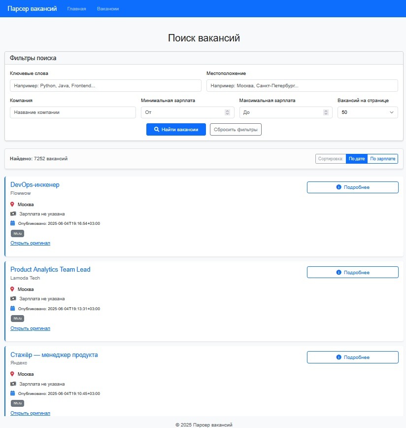

# Парсер Вакансий

Мощный парсер вакансий, который собирает информацию о вакансиях из различных источников. Приложение предоставляет удобный интерфейс для поиска и фильтрации вакансий.


*Главный интерфейс приложения*


*Пример результатов поиска вакансий*

## Возможности

- Парсинг вакансий из нескольких источников (HH.ru, superjob.ru)
- Поиск и фильтрация вакансий в реальном времени
- Подробные описания вакансий и требований
- Информация о компании и местоположении
- Информация о зарплате (если указана)
- Автоматическое сохранение вакансий в базу данных
- Удобный веб-интерфейс

## Установка

1. Клонируйте репозиторий:
```bash
git clone [https://github.com/Dema267/IT-parser.git]
cd job_parser
```

2. Создайте и активируйте виртуальное окружение:
```bash
python -m venv .venv
source .venv/bin/activate  # Для Windows: .venv\Scripts\activate
```

3. Установите зависимости:
```bash
pip install -r requirements.txt
```

4. Инициализируйте базу данных:
```bash
python init_db.py
```

## Использование

1. Запустите приложение:
```bash
python run.py
```

2. Откройте веб-браузер и перейдите по адресу `http://localhost:5000`

3. Используйте интерфейс поиска для поиска вакансий:
   - Введите ключевые слова в поле поиска
   - Фильтруйте результаты по различным критериям
   - Нажмите на вакансию для просмотра полной информации

## Структура проекта

```
job_parser/
├── app/              # Файлы веб-приложения
├── core/             # Основной функционал
├── parsers/          # Парсеры сайтов с вакансиями
├── services/         # Бизнес-логика
├── tests/            # Тесты
├── migrations/       # Миграции базы данных
├── metrics/          # Метрики производительности
├── requirements.txt  # Зависимости проекта
└── run.py           # Точка входа в приложение
```

## Зависимости

- Flask - Веб-фреймворк
- BeautifulSoup4 - Парсинг HTML
- Requests - HTTP-запросы
- APScheduler - Планировщик задач
- SQLite - База данных

## Участие в разработке

1. Сделайте форк репозитория
2. Создайте ветку для вашей функции (`git checkout -b feature/AmazingFeature`)
3. Зафиксируйте изменения (`git commit -m 'Добавлена новая функция'`)
4. Отправьте изменения в ветку (`git push origin feature/AmazingFeature`)
5. Создайте Pull Request

## Лицензия

Этот проект распространяется под лицензией MIT - подробности в файле LICENSE.

